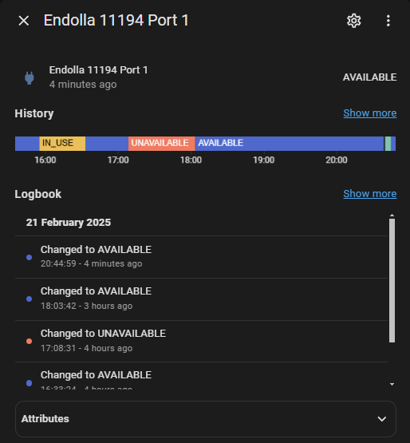

# Endolla – Home Assistant Integration

A custom integration for [Home Assistant](https://www.home-assistant.io/) that fetches live data from **Endolla Barcelona** open-data EV charging stations. It creates sensor entities for each port, showing its current status (AVAILABLE, IN_USE, etc.) and a last-updated timestamp.

## Features

- **Config Flow** in Home Assistant: just enter your Endolla station ID
- **Automatic polling** every 5 minutes (configurable in code)
- **One sensor per port** to see the charge point status
- Supports dynamic data from [Open Data Ajuntament de Barcelona](https://opendata-ajuntament.barcelona.cat/)

Example Sensor:

## Requirements

- Home Assistant 2023.2.0 or later
- Internet access to fetch the JSON data from Endolla’s open-data endpoint

## Installation

You can install this integration **manually** or via **HACS**.

### 1. Installation via HACS

1. Go to **HACS → Integrations**.
2. Click the **3-dot menu** in the top-right → **Custom repositories**.
3. Add your repository URL. Select **Integration** as the category, and click **Add**.
4. The “Endolla” integration should now appear under “Integrations.”
5. Click **Install** in HACS.
6. **Restart** Home Assistant.

### 2. Manual Installation

1. Download or clone this repository.
2. Copy the `endolla` folder inside `custom_components` to your Home Assistant’s `config/custom_components` directory.
3. **Restart** Home Assistant.

## Configuration

After Home Assistant restarts:

1. Go to **Settings → Devices & Services → Integrations**.
2. Click **Add Integration** and search for “Endolla” (or it might show automatically).
3. Enter the **station ID** (e.g., `11194`).
4. Save.

Home Assistant will fetch data every few minutes (default is 5 minutes) and create sensor entities named like **“Endolla <station_id> Port <port_id>”**, each reflecting the port’s status.

## Updating

- **HACS**: Just open HACS, check for updates, and install any new version of this custom integration.
- **Manual**: Pull or download the latest files and overwrite the old ones in `custom_components/endolla/`, then restart Home Assistant.

## Troubleshooting

- Check **Logs** (Settings → System → Logs) if sensors do not appear or if data is missing.
- The integration currently only supports **one** station ID per config entry. For multiple stations, add multiple entries.

## Disclaimer

This is an unofficial community integration. It uses the open-data endpoint from [Ajuntament de Barcelona](https://opendata-ajuntament.barcelona.cat/). The author(s) are not affiliated with Endolla or the Barcelona City Council.

---

### License

[MIT License](LICENSE)

Modify as you see fit. Enjoy!